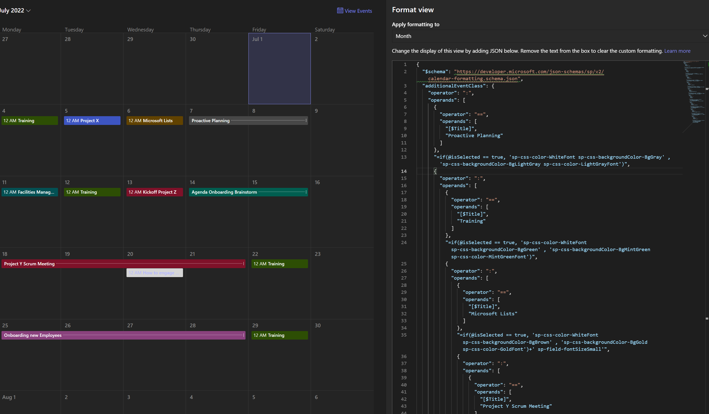

# SharePointModernCalendarView
This sample showcase how to use list &amp; column formatting in SharePoint in order to have a modern calendar view.
Below a preview:

* [Check my sample showed in the YouTube video](./sample.json)

📺check my YouTube Video tutorial to add the like and dislike button:
https://youtu.be/q-8BzgXEwGk